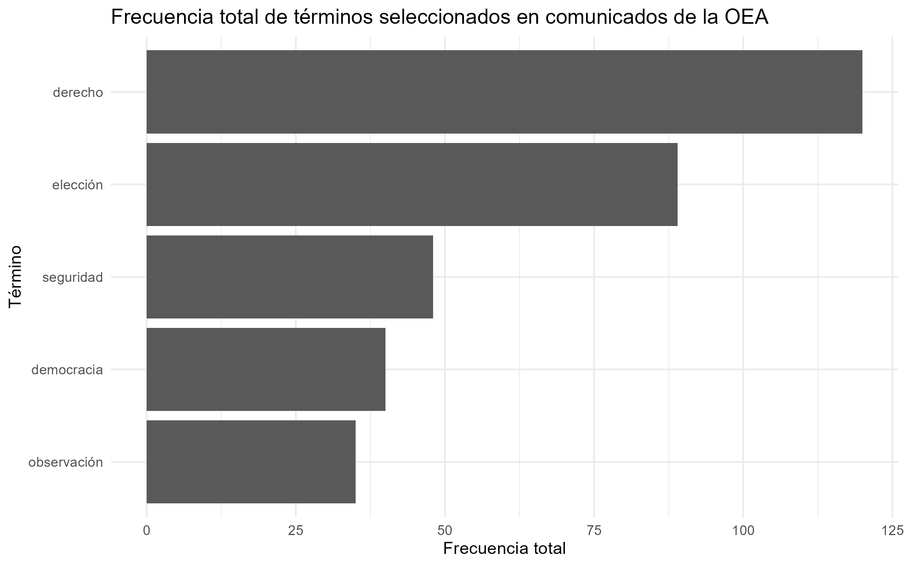

## Objetivo

El objetivo del trabajo es construir una base de datos propia a partir de los comunicados de prensa publicados por la Organización de los Estados Americanos entre enero y abril de 2026, y luego utilizar ese corpus textual para analizar la frecuencia de algunos términos relevantes.

Para esto, el trabajo se organiza en distintas etapas. Primero, se descargan los comunicados desde la página de la OEA y se guardan tanto los HTML originales como una tabla inicial en formato `.rds`. Luego, se limpia el texto de cada comunicado, se lematizan las palabras y se dejan únicamente sustantivos, verbos y adjetivos. Finalmente, se construye una matriz documento término y se genera una figura con la frecuencia total de cinco términos seleccionados.

## Correr el código

```{r}
library(here)

# Ejecutar cada etapa en orden
source(here("TP2", "scripts", "scraping_oea.R"))
source(here("TP2", "scripts", "processing.R"))
source(here("TP2", "scripts", "metrics_figures.R"))
```

## Estructura del proyecto

El proyecto se organiza dentro de la carpeta `TP2`. La idea de esta estructura es separar los archivos según el momento del trabajo y el tipo de resultado que generan.

En la carpeta `data` quedan guardados los archivos que salen directamente del scraping. Allí se guardan las copias HTML de las páginas mensuales consultadas y también la tabla inicial `comunicados_oea_enero_abril_2026.rds`, que contiene los comunicados organizados con tres variables: `id`, `titulo` y `cuerpo`.

En la carpeta `scripts` están los tres códigos principales. El script `scraping_oea.R` se encarga de leer las páginas de la OEA, extraer los títulos, construir los links completos, entrar a cada comunicado y guardar el cuerpo de la noticia. El script `processing.R` toma esa tabla inicial, limpia el texto, lematiza el contenido y remueve palabras vacías. El script `metrics_figures.R` toma el texto procesado, construye la matriz documento término y genera el gráfico final.

En la carpeta `output` se guardan los resultados finales del procesamiento y del análisis. Allí quedan el archivo `processed_text.rds`, la matriz `dtm_oea.rds`, la tabla `frecuencia_terminos.rds` y la figura `frecuencia_terminos.png`.

## Criterio de análisis

Ya con el corpus procesado, el análisis se concentra en cinco términos relacionados con el rol institucional de la OEA: `derecho`, `elección`, `seguridad`, `democracia` y `observación`.

La selección de estos términos se realizó buscando dimensiones importantes del trabajo de la organización. Por un lado, `derecho` y `democracia` permiten observar si los comunicados usan un vocabulario vinculado con normas, garantías e institucionalidad democrática. Por otro lado, `elección` y `observación` permiten captar la relevancia de los procesos electorales y de las misiones de observación. Por último, `seguridad` incorpora una dimensión más general de estabilidad regional.

## Figura final



## Interpretación

A partir del gráfico se observa que el término con mayor frecuencia total es `derecho`, con 120 apariciones. Esto muestra que, dentro de los comunicados analizados, la OEA utiliza con bastante frecuencia un lenguaje asociado a normas, garantías y marcos jurídicos.

El segundo término con mayor frecuencia es `elección`, con 89 apariciones. Esto resulta consistente con el rol de la OEA en el seguimiento de procesos electorales, especialmente a través de misiones de observación y comunicados vinculados con elecciones en distintos países de la región.

Después aparece `seguridad`, con 48 apariciones. Si bien tiene una frecuencia menor que `derecho` y `elección`, sigue siendo un término relevante porque permite ver que la agenda de comunicados no se limita solamente a cuestiones electorales, sino que también incorpora preocupaciones vinculadas con estabilidad y condiciones políticas o sociales más amplias.

Por último, `democracia` y `observación` aparecen con 40 y 35 apariciones respectivamente. Estos dos términos refuerzan la misma tendencia general: los comunicados analizados están atravesados por temas institucionales, democráticos y electorales.

En conjunto, los resultados muestran que los comunicados de la OEA entre enero y abril de 2026 se concentran especialmente en derechos, elecciones, seguridad, democracia y observación. A partir de esto, podemos interpretar que la agenda pública de la OEA durante el período estuvo vinculada con su rol regional en el seguimiento de procesos políticos, electorales e institucionales.
